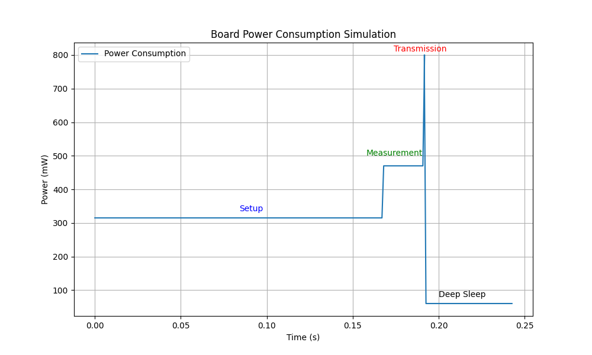

# Challenge 1: Wokwi and Power Consumption

The Node aim is to communicate to a central sink node the occupancy of a parking slot.

## Application requirements

The node has to:
- Periodically sample the HC-SR04 sensor
- Understand if a car is present or not
- Transmit the data sample (FREE/OCCUPIED)
- Go in deep sleep state for some time

The node should:
- Consume the less amount of power possible

Parameters:
- Duty cycle: $(44 \space \% \space 50) + 5 = 49s$
- Battery energy: $5344 + 5 = 5349Joule$

## Assumptions

- The sink node has no energy constraints
- The sink node is always reachable by every sensor node
- A sensor node is present on every parking spot

## 1: Application code

### Overall code structure

The application code is rather simple as there are 4 major steps:
1. **Setup**: When the device boots up, the ESP-NOW protocol, transmission power and sensor are initialized
2. **Measurement**: A sensor measurement is performed
3. **Transmission**: The parking spot state is sent via radio
4. **Deep-sleep**: The MCU enters in deep sleep state to save power

### Estimation of state durations

In order to estimate the duration of each of the states, we both made empirical measurements and theoretical calculations.

To estimate the time duration of each state, we sampled the microcontroller system time between each state. By running the on Wokwi code we got the following result:
- **Setup**: $168216\mu{s}$
- **Mesurement**: $23845\mu{s}$
- **Transmission**: $852\mu{s}$

Note that in order to study a more power hungry case we considered the case where the ultrasonic sensor measure an obstacle at 400cm (i.e. it's maximum distance). Note also that the call of the function `micros()`, used to get the time in various point of the code, can increase the execution time, but it is ignored.

We also compared the measured measurement time with the theoretical time required by the sensor. The HC-SR04 is based on ultrasounds, which travels approximately at $340m/s$. Considering a maximum distance of $4m$, the sensor should take $\frac{4}{340} \cdot 2 = 23529\mu{s}$, which is almost identical to the measured time.

## 2: Energy consumption esitmation

From the provided log files, we measured the following power consumptions:
- **Idle**: $315mW$
- **Measurement**: $470mW$
- **Transmission at 19.5dBm**: $1250mW$
- **Transmission at 2dBm**: $800mW$
- **Deep-sleep**: $60mW$

Given the application requirements, where all the nodes are in a parking area, we assume that the sink node is relatively close to the nodes. For this reason we can transmit at 2dBm power.

Considering the power consumption and duration of each relative state, we can estimate the power consumption of one cycle:
- **Setup**: $315mW \cdot 168216\mu{s} = 60mJ$
- **Measurement**: $470mW \cdot 23845\mu{s} = 11.2mJ$
- **Transmission at 2dBm**: $800mW \cdot 852\mu{s} = 0.7mJ$
- **Deep-sleep**: $60mW * 49s = 2940mJ$

Total consumption of one cycle: $3.0119J$

Total cycle duration: $49.193s$

Considering a battery capable of $5349J$, we can achieve an power-on time of $1775cycles$, that is $24.268hours$.

## 3: Comments on results and possible improvements

The implemented system provides a power-on time of only roughly one day. This results in a terrible product because recharging the battery of every node each day is not acceptable.

The measurement state takes the most amount of energy!

Considering the original application requirements, we could consider several possible improvements to the current implementation:
- A cycle duration of $~50s$ may be too short or long, depending on the application goals. If we could increase the deep-sleep duration, one battery cycle would last more time.
- Currently, the node transmit the measured data at each cycle, even if the parking slot state did not change. By comparing the current measurement against the previous one (we could store it in the ESP32's RTC RAM, that is maintained during deep-sleep), we could use the radio to transmit only state changes. This would reduce the power consumption since the parking slots occupancies does not change very frequently.
- Implement a solar panel and a battery charger circuit. This could entirely avoid the need to recharge the battery.
- The measurement state is currently the most power hungry state. This is due to the sensor being used, the HC-SR04. There exists other types of sensors which are more power efficient (e.g. a time-of-flight sensor such as the [VL53L3CX](https://www.google.com/url?sa=t&rct=j&q=&esrc=s&source=web&cd=&cad=rja&uact=8&ved=2ahUKEwj10vPO1oCFAxUyiP0HHXg1Bd4QFnoECBEQAQ&url=https%3A%2F%2Fwww.st.com%2Fresource%2Fen%2Fdatasheet%2Fvl53l3cx.pdf&usg=AOvVaw20QK3Kygxh3pnP4ZW6VR6d&opi=89978449) from ST consumes $~44.8mW$). We could also take advantage of power saving features of sensors, or cut power to them while in deep-sleep.
- One device could cover more than one parking slot by implementing multiple sensors.
- The transmission protocol and radio could be changed to other technologies, for example LoRa is more power efficient than WiFi based ones
- Optimize the device by developing a custom board with better hardware. On the market there could be more efficient components than those used on the development board used in our lab tests.
