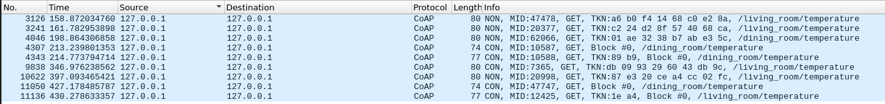
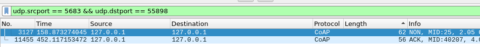
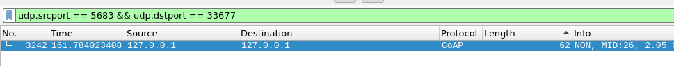
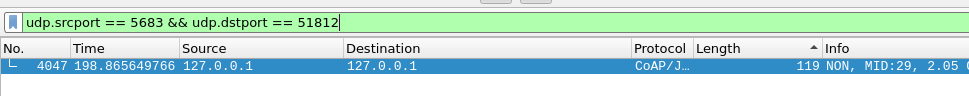
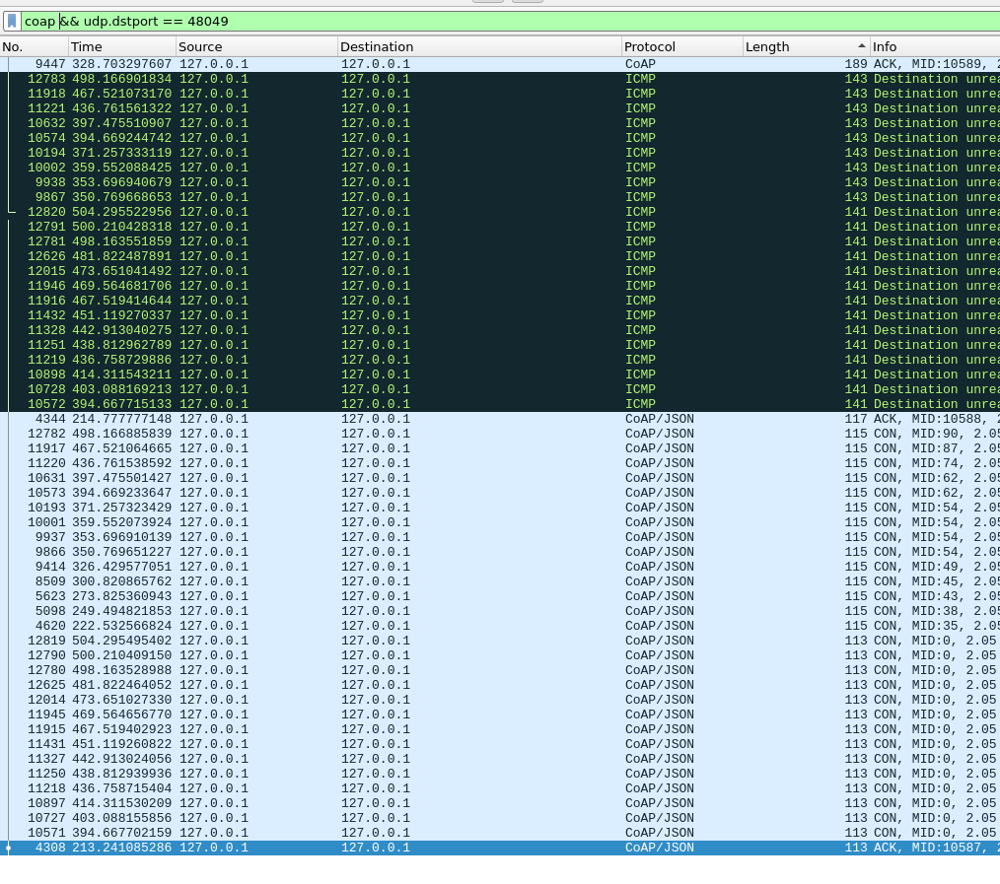
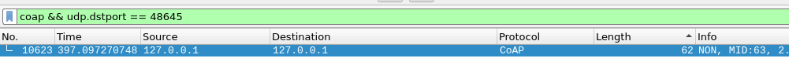
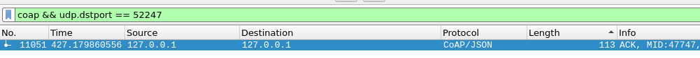
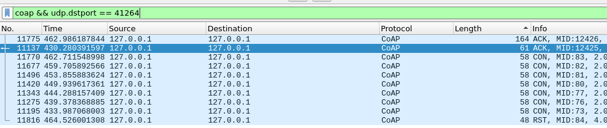

# Challenge 2: CoAP and MQTT Traffic Analysis

The goal of this challenge is to analyze the CoAP and MQTT traffic given a log

## Questions

The questions to be answered are:

1.  - How many different CoAP clients sent a GET request to a temperature resource (../temperature)?
    - For each of the clients found in 1a, write the MID of the longest
      CoAP response (any response) received by the client
2.  - How many CoAP POST requests directed to the "coap.me" server
      did NOT produce a successful result?
    - How many requests from 2a are directed to a "weird"
      resource? (resources like /weirdXX)?
3.  - How many MQTT Publish messages with qos=2 are RECEIVED by
      the clients running in the machine capturing the traffic?
    - How many clients are involved in the messages found in 3a?
    - What are the MQTT Message identifiers (ID) of the subscribe
      requests that let the client receive the messages found in 3a?
4.  - How many MQTT clients sent a subscribe message to a public broker
      using at least one wildcard?
    - Considering clients found in 4a, how many of them WOULD receive
      a publish message directed to the topic:
      "metaverse/facility4/area0/light“
5.  - How many MQTT ACK messages in total are received by clients
      who connected to brokers specifying a client identifier shorter than
      15 bytes and using MQTT version 3.1.1?
6.  - How many MQTT subscribe requests with message ID=1 are directed
      to the HiveMQ broker?
    - How many publish messages are received by the clients thanks to the
      subscribe requests found in 6a
7.  - How many MQTT-SN (on port 1885) publish messages sent after the
      hour 3.59PM (Milan Time) are directed to topic 6?
    - Explain possible reasons why messages in 7a are not handled by the
      server

## Answers

1. - `udp.dstport == 5683 && coap.code == 1 && coap.opt.uri_path ==        "temperature"`\
     
     which are 9 different packet, but 2 messages with (Message ID: 10587 & Message ID: 10588) have the same Source Port: 48049.\
     We assume a different port for each client, so the different clients that respect the query are:
     1. Source Port: 55898 2. Source Port: 33677 3. Source Port: 51812 4. Source Port: 48049 5. Source Port: 52276 6. Source Port: 48645 7. Source Port: 52247 8. Source Port: 41264
   - sort with respect to length\
     `udp.srcport == 5683 && udp.dstport == Source Port`\

   1. Source Port: 55898, MID: 25
      
   2. Source Port: 33677, MID: 26
      
   3. Source Port: 51812, MID: 29
      
   4. Source Port: 48049, MID: 10589
      
   5. Source Port: 52276, MID: 7365
      
   6. Source Port: 48645, MID: 63
      
   7. Source Port: 52247, MID: 47747
      
   8. Source Port: 41264, MID: 12426
      

2. - Script 2.1 (17)
   - Script 2.2 (8)
3. - `mqtt && tcp.port == 1883 && mqtt.msgtype == 3 && mqtt.qos == 2 && (ip.dst_host == "127.0.0.1" || ip.dst_host == "10.0.2.15") && tcp.srcport == 1883`\
     where the destination address must be either internal or the public one and the src port must be the broker one (aka the service), so 1883. Based on these assumptions, the number or received messages is 2 with qos = 2
   - The number of involved clients based on the previous assumption is 1
   - `mqtt && tcp.port == 1883 && mqtt.msgtype == 8 && mqtt.topic contains "hospital" && ip.dst_host == "3.65.168.153" && tcp.srcport == 59385`\
     We are looking for these topics:
     - `hospital/facility2/section0` (3.65.168.153) (dst port 59385)
     - `hospital/facility2/room4/temperature` (3.65.168.153) (dst port 59385)
       For both of them, the subscription topic is `hospital/#` with a MID of 15
4. - `mqtt && mqtt.msgtype == 8 && ip.dst_host != "127.0.0.1" && (mqtt.topic contains "+" || mqtt.topic contains "#")`\
     By sorting with respect to the source port, it can be seen that the number of different clients which used at least one wildcard to subscribe to a topic on a public broker is 4:
     1. Source Port: 59385;
     2. Source Port: 38887;
     3. Source Port: 37419;
     4. Source Port: 36707.
   - Script4.2 reveals that 2 of the 4 clients would receive the message:
     1. Source Port: 59385 -> metaverse/facility4/+/light
     2. Source Port: 37419 -> metaverse/+/area0/light
5. - `mqtt && mqtt.msgtype == 1 && mqtt.clientid_len <= 15 && mqtt.ver == 4`\
     This query specifies the two clients that connected to brokers with a client identifier with length less (or equal) to 15 bytes and with MQTT version of 3.1.1.\
     `mqtt && (mqtt.msgtype == 2 || mqtt.msgtype == 9 || mqtt.msgtype == 4) && (tcp.dstport == 43949 || tcp.dstport == 44887)`
     This query displays all the ACKs that the two clients received, including connect ACK, subscribe ACK and publish ACK. The total number of received ACKs is 20
