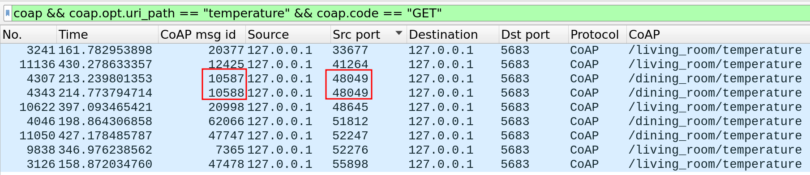

# Challenge 2: CoAP and MQTT Traffic Analysis

The goal of this challenge is to analyze the CoAP and MQTT traffic given a log

## Questions

The questions to be answered are:

1. a. How many different CoAP clients sent a GET request to a temperature resource (../temperature)?
   b. For each of the clients found in 1a, write the MID of the longest CoAP response (any response) received by the client
2. a. How many CoAP POST requests directed to the "coap.me" server did NOT produce a successful result?
   b. How many requests from 2a are directed to a "weird" resource? (resources like /weirdXX)?
3. a. How many MQTT Publish messages with qos=2 are RECEIVED by the clients running in the machine capturing the traffic?
   b. How many clients are involved in the messages found in 3a?
   c. What are the MQTT Message identifiers (ID) of the subscribe requests that let the client receive the messages found in 3a?
4. a. How many MQTT clients sent a subscribe message to a public broker using at least one wildcard?
   b. Considering clients found in 4a, how many of them WOULD receive a publish message directed to the topic: "metaverse/facility4/area0/light“
5. a. How many MQTT ACK messages in total are received by clients who connected to brokers specifying a client identifier shorter than 15 bytes and using MQTT version 3.1.1?
6. a. How many MQTT subscribe requests with message ID=1 are directed to the HiveMQ broker?
   b. How many publish messages are received by the clients thanks to the subscribe requests found in 6a
7. a. How many MQTT-SN (on port 1885) publish messages sent after the hour 3.59PM (Milan Time) are directed to topic 6?
   b. Explain possible reasons why messages in 7a are not handled by the server

## Answers

1. a. `coap && coap.opt.uri_path == "temperature" && coap.code == "GET"`\
    8 different clients sent a GET request to a temperature resource.\
    There are 9 different packets, but 2 messages (with ids 10587 and 10588) have the same Source Port (48049). We assume a different port for each client, so there are 8 different clients.\
    
   b. `udp.srcport == 5683 && udp.dstport == <Client Port>`\
    By filtering all CoAP messages for each of the client and by sorting with respect to length, the longest responses are:
     1. Client Port: 55898, MID: 25
     2. Client Port: 33677, MID: 26
     3. Client Port: 51812, MID: 29
     4. Client Port: 48049, MID: 10589
     5. Client Port: 52276, MID: 7365
     6. Client Port: 48645, MID: 63
     7. Client Port: 52247, MID: 47747
     8. Client Port: 41264, MID: 12426
2. a. There are 18 POST requests directed to "coap.me" which ended in failure (see `scripts/2.a.py`)
   b. There are 8 POST requests directed to a weird resource of "coap.me" which ended in failure (see `scripts/2.b.py`)
3. a. `mqtt && tcp.port == 1883 && mqtt.msgtype == 3 && mqtt.qos == 2 && (ip.dst_host == "127.0.0.1" || ip.dst_host == "10.0.2.15") && tcp.srcport == 1883`\
     The number or received messages is 2.\
     The destination address must be either internal or the public one and the src port must be the broker one (aka the service), so 1883.
   b. The number of involved clients based on the previous assumption is 1.
   c. `mqtt && tcp.port == 1883 && mqtt.msgtype == 8 && mqtt.topic contains "hospital" && ip.dst_host == "3.65.168.153" && tcp.srcport == 59385`\
     We are looking for these topics:
      - `hospital/facility2/section0` (3.65.168.153) (dst port 59385)
      - `hospital/facility2/room4/temperature` (3.65.168.153) (dst port 59385)
       For both of them, the subscription topic is `hospital/#` with a MID of 15
4. a. `mqtt && mqtt.msgtype == 8 && ip.dst_host != "127.0.0.1" && (mqtt.topic contains "+" || mqtt.topic contains "#")`\
     The number of clients is 4.\
     By sorting the messages with respect to the source port, there are 4 different clients which used at least one wildcard to subscribe to a topic on a public broker:
     1. Client Port: 59385;
     2. Client Port: 38887;
     3. Client Port: 37419;
     4. Client Port: 36707.
   b. 2 of the 4 clients would receive the message (see `script/4.b.py`):
     5. Client Port: 59385 -> `metaverse/facility4/+/light`
     6. Client Port: 37419 -> `metaverse/+/area0/light`
5. a. `mqtt && mqtt.msgtype == 1 && mqtt.clientid_len <= 15 && mqtt.ver == 4`\
     There are 2 clients which connected to brokers with a client identifier with length less (or equal) to 15 bytes and with MQTT version of 3.1.1.\
     `mqtt && (mqtt.msgtype == 2 || mqtt.msgtype == 9 || mqtt.msgtype == 4) && (tcp.dstport == 43949 || tcp.dstport == 44887)`
     This query displays all the ACKs that the two clients received, including connect ACK, subscribe ACK and publish ACK.\
     The total number of received ACKs is 20
6. a. `dns && dns.qry.name contains "hivemq"`\
     This query reveals all the dns packets about hivemq broker. The correct IP addresses are: 3.66.35.116 and 3.65.168.153.\
     `mqtt && mqtt.msgtype == 8 && (ip.dst_host == "3.66.35.116" || ip.dst_host == "3.65.168.153") && mqtt.msgid == 1`\
     This query looks for messages with MID = 1 of MQTT directed to the hivemq broker. It reveals that there are 3 total subscription queries
