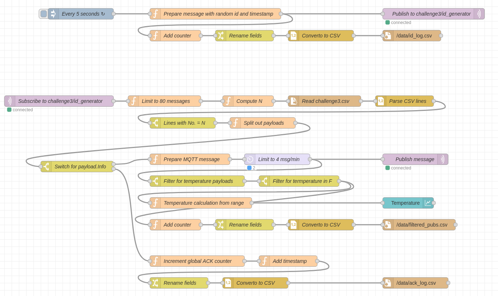
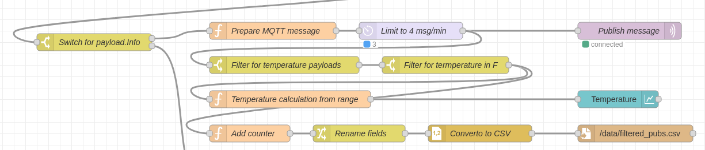

# Challenge 3: Node-Red

The goal of this challenge is to implement a node on the Node-Red framework, which interacts with an MQTT local server.

## Team Members

- Alberto Nidasio 10665344
- Federico Mandelli 10611353
- Matteo Pignataro 10667498

## Flow explanation

### Publisher

The publisher flow is composed by:

1. Inject node: A node that starts the flow configured to run every 5 seconds
2. Random id node: A function node thats create the packet payload with a random number (using Math.random()) and the timestamp
   (using Date.n)
3. Publish node: to publish the message.
4. Add counter: Responsible to keep tracks of the number of message sent by incrementing a counter saved in the flow.
5. Rename fields: Used to parse the necessary field names into the required ones.
6. Convert to CSV: Used to write (create if not present) the csv file in the specified path.

### Subscriber

The subscriber flow encounters:

1. Message limiter: A node that limits the total number of received messages to 80 using a flow variable named `received_counter`
2. N computer: A node that takes as input the MQTT message ID and computes the modulus operator of it with the number 7711
3. CSV parser: A series of nodes which allows the flow to parse the `challenge3.csv` file and to look specifically for the row with `No.` equal to the previously computed N
4. Payload splitter: A node which analyzes the Info column of the CSV selected row in order to find (if present) multiple MQTT publish messages and to threat them as multiple messages to send. The node spits out an array of messages in case of multiple MQTT publish in the Info field, else it sends out the input Payload field

### Subscriber MQTT-Publish

The MQTT-Publisher sub-flow is composed by:

1. Prepare message: A node that creates a new message saving the needed
   information for the rest of the flow to use.
2. Rate limit: used to limit the rate of the flow to 4 msg/min as required by the assignment.
3. Publish message: To publish the message to the topic.
4. Filter chain: 2 filter nodes are used to filter only the messages that contain temperature (indicated by type) and are in fahrenheit (indicated by F in unit).
5. Temperature calculation: Used to calculate the temperature by doing the avg of the range values.
6. ui_chart: Used to plot the values.

### Subscriber ACK

The subscriber ack flow encounters:

1. ACK incrementer: A node that increments a global ACK counter
2. Timestamp adder: A node that sets as payload timestamp the current date in Unix representation
3. CSV logger: A series of nodes that rename the data structure fields to the requested ones and save the ACK message into a CSV log file
